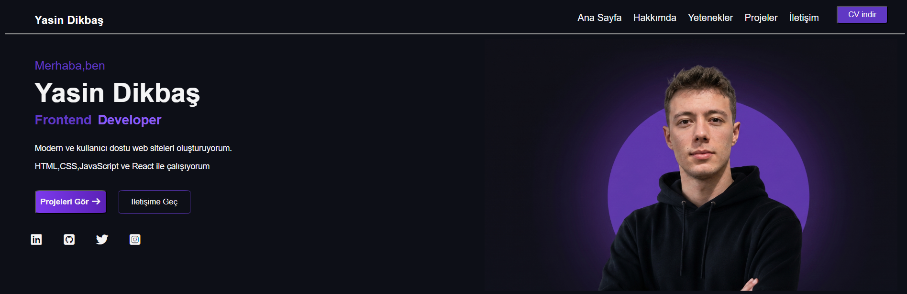
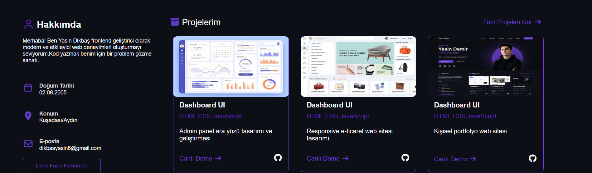

# 🌐 Personal Portfolio

<p align="center">

Personal Portfolio Website developed with HTML & CSS

</p>

<!-- Yasin Dikbaş -->

<h1 align="center">Hi 👋, I'm Yasin Dikbaş </h1>

<!-- Frontend developer -->

<h3 align="center">Frontend Developer | Software Engineering Student</h3>

<br>

<!-- Teknoloji rozetleri -->

<p align="center">


</p>

<br>

<!-- Canlı site butonu -->

<p align="center">

<a href="https://yasin-dikbas.github.io/portfolio/" target="_blank">


</a>

</p>

---

# 📸 Preview

<!--


-->

<p align="center">


<br><br>


</p>

---

# 📖 About The Project

This is my personal portfolio website built with **HTML5** and **CSS3**.

The project showcases my frontend development skills, personal information, and projects through a modern, clean, and user-friendly interface.

It serves as my first complete frontend portfolio and will continue to evolve as I learn new technologies such as JavaScript and React.

---

# ✨ Features

* Modern Dark Theme
* Hero Section
* About Me Section
* Project Cards
* Social Media Icons
* Clean UI Design
* Download CV Button
* Semantic HTML Structure
* Organized CSS File
* Fully Custom Design
* Desktop-first layout

---

# 🛠 Technologies Used

| Technology   | Description       |
| ------------ | ----------------- |
| HTML5        | Website Structure |
| CSS3         | Styling           |
| Font Awesome | Icons             |

---

# 📂 Folder Structure

```text
portfolio/
│
├── index.html
├── style.css
├── README.md
│
└── resimler/
      preview1.png
      preview2.png
      portfolyo.png
      personal portfolyo.png
      dashboard-UI.png
      e-commerece.png
      
```

---

# 🚀 Live Demo

### 🌍 Website

**https://yasin-dikbas.github.io/portfolio/**

---

# 🔮 Future Improvements

* JavaScript functionality
* Smooth scrolling
* Contact Form
* Better Animations
* Responsive Design
* Dark / Light Mode
* React Version
* Improve responsiveness across different screen sizes

---

# 👨‍💻 About Me

I'm a Software Engineering student passionate about web development and modern user interfaces.

I enjoy building clean and user-friendly web applications while continuously improving my skills through personal projects.

Currently learning:

* HTML
* CSS
* JavaScript
* React


---

# 📬 Contact

📧 Email: **dikbasyasin6@gmail.com**

💼 LinkedIn: https://tr.linkedin.com/in/yasin-dikba%C5%9F-a9a001384

🐙 GitHub: **https://github.com/Yasin-Dikbas**

🌍 Portfolio: **https://yasin-dikbas.github.io/portfolio/**

---

## 📝 Note

This project is currently optimized for desktop devices. Responsive support for tablets and mobile devices is planned for future updates.

# ⭐ Support

If you like this project, please consider giving it a ⭐ on GitHub.

Thank you for visiting my repository ❤️

Made with ❤️ by **Yasin Dikbaş**
